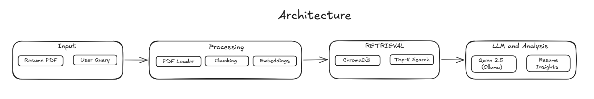

<h1 align="center">AI Resume Analyzer</h1>

## Overview
This project uses Retrieval-Augmented Generation (RAG) to parse resumes, compare them against a job description, and generate an ATS-style analysis with a local LangChain + Ollama stack.

## Architecture Diagram

<p align="center">
  
</p>


## Key Features

- Resume PDF ingestion and processing
- Semantic document chunking and embedding generation
- Vector-based retrieval using ChromaDB
- Retrieval-Augmented Generation (RAG) pipeline
- Local LLM inference using Qwen2.5 via Ollama
- Context-aware resume and job description analysis

## Tech Stack

- Python
- LangChain
- Streamlit
- ChromaDB
- HuggingFace
- Ollama
- LLM (qwen2.5:1.5b)

## Installation

### 1. Clone the Repository

```bash
git clone https://github.com/msaakaash/ai-resume-analyzer
cd ai-resume-analyzer
```

### 2. Create and Activate a Virtual Environment

**Windows**

```bash
python -m venv venv
venv\Scripts\activate
```

**Linux / macOS**

```bash
python3 -m venv venv
source venv/bin/activate
```

### 3. Install Dependencies

```bash
pip install -r requirements.txt
```

### 4. Install and Pull the Local LLM

Ensure Ollama is installed and running.

```bash
ollama pull qwen2.5:1.5b
```

### 5. Start the Application

```bash
streamlit run main.py
```


## License  
This project is licensed under the [MIT LICENSE](./docs/LICENSE).

